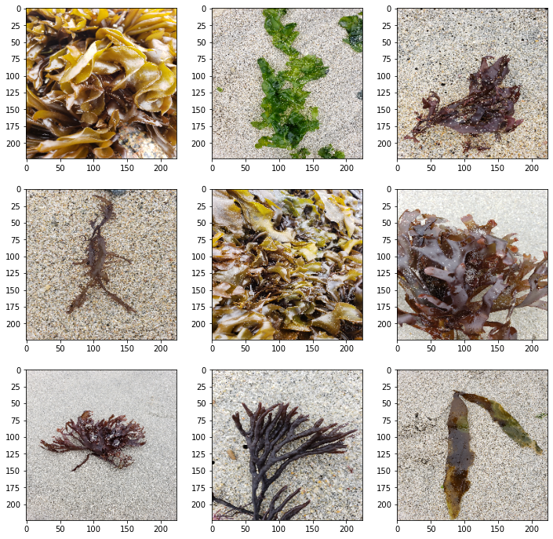
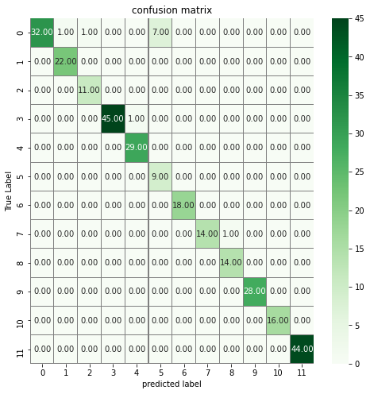
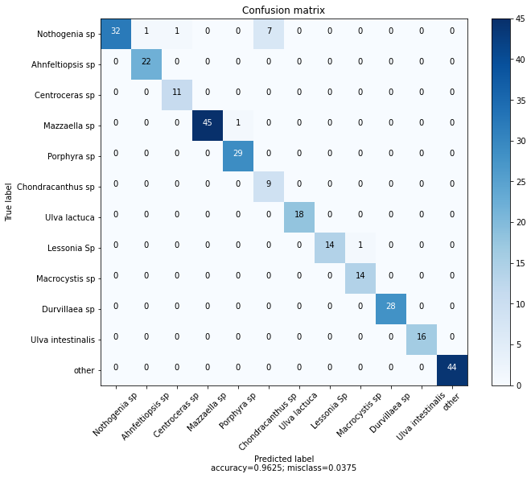
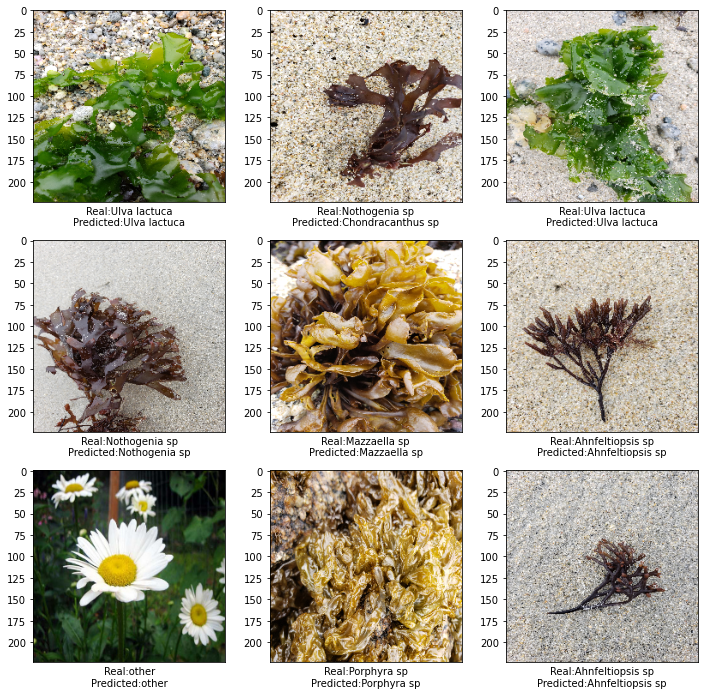
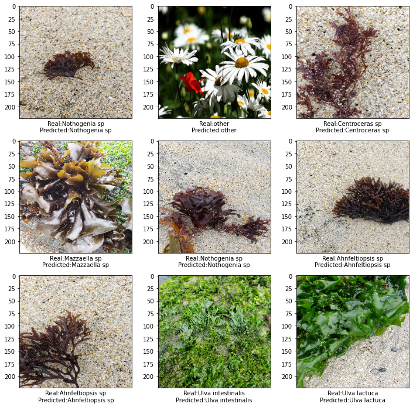

<h2>Algae classifier for the coasts of central Chile, Southamerica</h2>
<p>Prepared by Félix Garcias, f.garcias@uc.cl</p>


## Introductión
This projects includes both back-end (Keras, Flask with dependencies) and the implementation (HTML, CSS, JS) that was finally hosted on Heroku.

This app is designed for those people who they like to walk through the intertidal rocky and the coast in general. Therefore, this model was trained with images of stranded algae on the beach and others algae that we find naturally on rocks. For images taken in laboratory circumstances or other situation, the model could present greater percentage of error to classify.

For this first version, approximately 2.300 images were used, which were separated into a training, test and validation sample (1.949, 345 and 104, respectively).

The images were captured in the following geographic zone:


An ImageDataGenerator process was used to increase the number of images. Each of the images was rotated, warped, etc. In addition, a Dropout process was used in the last layer of the neural network to avoid the possible correlation increase generated by ImageDataGenerator.

And although the confusion matrix showed a greater degree of error between 𝑁𝑜𝑡ℎ𝑜𝑔𝑒𝑛𝑖𝑎 𝑓𝑎𝑠𝑡𝑖𝑔𝑖𝑎𝑡𝑎 and 𝐶ℎ𝑜𝑛𝑑𝑟𝑎𝑐𝑎𝑛𝑡ℎ𝑢𝑠 𝑐ℎ𝑎𝑚𝑖𝑠𝑠𝑜𝑖, and to a lesser degree between 𝐴ℎ𝑛𝑓𝑒𝑙𝑡𝑖𝑜𝑝𝑠𝑖𝑠 𝑑𝑢𝑟𝑣𝑖𝑙𝑙𝑒𝑖 and 𝐶𝑒𝑛𝑡𝑟𝑜𝑐𝑒𝑟𝑎𝑠 𝑐𝑙𝑎𝑣𝑢𝑙𝑎𝑡𝑢𝑚, the truth is that it is still necessary to strengthen the correct classification in brown macroalgae because it was in this group where fewer images were available. This was observed with the validation sample.

<h3>Construct the Convolutional Neuronal Network (CNN) Architecture and train the model with data</h3>

#### import packages and libraries


```python
import numpy as np
import matplotlib.pyplot as plt
import pandas as pd
import itertools
import os, stat, time
from os.path import dirname as up
import h5py 
import cv2
import pickle
import PIL
from PIL import Image

```


```python
import tensorflow as tf
from tensorflow.python.keras.preprocessing.image import ImageDataGenerator
from tensorflow.python.keras import optimizers
from tensorflow.python.keras.models import Sequential
from tensorflow.python.keras.layers import Dropout, Flatten, Dense, Activation
from tensorflow.python.keras.layers import  Convolution2D, MaxPooling2D
from tensorflow.python.keras import backend as K
from tensorflow import keras
from tensorflow.python.keras.models import Sequential
from tensorflow.python.keras.layers import Activation
from tensorflow.python.keras.layers.core import Dense, Flatten, Dropout
from tensorflow.python.keras.optimizers import Adam
from tensorflow.python.keras.optimizers import RMSprop
from tensorflow.python.keras.metrics import categorical_crossentropy
from tensorflow.python.keras.regularizers import l2
from tensorflow.python.keras.layers.convolutional import *
from tensorflow.python.keras.layers.normalization import BatchNormalization
from tensorflow.python.keras.optimizers import SGD
from tensorflow.keras.models import model_from_json
from tensorflow.python.framework import ops
ops.reset_default_graph()

from keras.preprocessing.image import ImageDataGenerator, array_to_img, img_to_array, load_img
```

### Transforming the images a picke file

The pickle module can store things such as data types such as booleans, strings, and byte arrays, lists, dictionaries, functions, and more. Note: The concept of pickling is also known as serialization, marshaling, and flattening. However, the point is always the same to save an object to a file for later retrieval.


```python

data_dir = "./data/Algas2"


categories = ['Sp1 Nothogenia fastigiata', 'Sp2 Ahnfeltiopsis durvillei', 'Sp3 Centroceras clavulatum', 'Sp4 Mazzaella laminarioides', 'Sp5 Porphyra columbina', 'Sp6 Chondracanthus chamissoi', 'Sp7 Ulva lactuca', 'Sp8 Lessonia Sp', 'Sp9 Macrocystis pyrifera', 'Sp10 Durvillaea antarctica', 'Sp11 Ulva intestinalis','other']


data = []

def make_data():
    for category in categories:
        path = os.path.join(data_dir, category) # ./data/flowers/dasiy

        for img_name in os.listdir(path):
            image_path = os.path.join(path, img_name)
            label = categories.index(category)
            image = cv2.imread(image_path)

            try:
                image = cv2.cvtColor(image, cv2.COLOR_BGR2RGB)
                image = cv2.resize(image, (224,224),3)

                image =np.array(image, dtype=np.float32)

                data.append([image, label])

            except Exception as e:
                pass

    print(len(data))

    pik = open('data.pickle', 'wb')
    pickle.dump(data, pik)
    pik.close()


make_data()	

def load_data():
    pick = open('data.pickle', 'rb')
    data = pickle.load(pick)
    pick.close()

    np.random.shuffle(data)

    feature = []
    labels = []

    for img, label in data:
        feature.append(img)
        labels.append(label)

    feature = np.array(feature, dtype=np.float32)
    labels = np.array(labels)

    feature = feature/255.0

    return [feature, labels]
```

    2294
    

### Train and test sample

Using sklearn.model_selection to separate the images into a training sample and a test sample. The test sample contains 15% of the data.


```python
from sklearn.model_selection import train_test_split

(feature, labels) = load_data()

x_train, x_test, y_train, y_test = train_test_split(feature, labels, test_size=0.15)
```


```python
print("There are {} training examples".format(x_train.shape[0]))
print("There are {} test examples".format(x_test.shape[0]))
print("There are {} training examples".format(y_train.shape[0]))
print("There are {} test examples".format(y_test.shape[0]))
```

    There are 1949 training examples
    There are 345 test examples
    There are 1949 training examples
    There are 345 test examples
    

### Seeing some images of the training sample


```python
plt.figure(figsize=(12,12))
for i in range(9):
    # define subplot
    plt.subplot(330 + 1 + i)
    # plot raw pixel data
    plt.imshow(x_train[i+330])
# show the figure
plt.show()
```





### ImagenDataGenerator

In general, when we have a relatively small number of images, we can increase the number by modifying the original images (zooming, scaling, horizontal flip, etc). With this, we can partially improve the quality of the model.


```python
augmenter = ImageDataGenerator(horizontal_flip=True,
                               rotation_range=0.15,
                               width_shift_range=0.1,
                               height_shift_range=0.1,
                               zoom_range=0.15,
                               shear_range=0.1,
                               fill_mode='nearest')
```

### Building the non-sequential Convolutional Neural Network (CNN)

Although sequential convolutional models were tested in which each layer is a linear relationship in sequence, and the structure of the model is formulated through a list, in this first proposal a general model was chosen, with which a structure can be built network more flexibly and establish the relationship of each level.

Since an ImagenDataGenerator process was used, which generally exerts a negative autocorrelation effect on the model, I opted to use a dropout process (25%)


```python

input_layer = tf.keras.layers.Input([224,224,3])

conv1 = tf.keras.layers.Conv2D(filters =32, kernel_size=(5,5), padding='Same',
    activation = 'relu')(input_layer)

pool1 = tf.keras.layers.MaxPooling2D(pool_size=(2,2))(conv1)


conv2 = tf.keras.layers.Conv2D(filters =64, kernel_size=(3,3), padding='Same',
    activation = 'relu')(pool1)

pool2 = tf.keras.layers.MaxPooling2D(pool_size=(2,2),strides=(2,2))(conv2)


conv3 = tf.keras.layers.Conv2D(filters =96, kernel_size=(3,3), padding='Same',
    activation = 'relu')(pool2)

pool3 = tf.keras.layers.MaxPooling2D(pool_size=(2,2), strides=(2,2))(conv3)


conv4 = tf.keras.layers.Conv2D(filters =96, kernel_size=(3,3), padding='Same',
    activation = 'relu')(pool3)

pool4 = tf.keras.layers.MaxPooling2D(pool_size=(2,2), strides=(2,2))(conv4)


flt1 = tf.keras.layers.Flatten()(pool4)

#flt2 = tf.layers.Dropout(flt1, rate=dropout)

dn1 = tf.keras.layers.Dense(512, activation='relu')(flt1)

drop = tf.keras.layers.Dropout(0.25, noise_shape=None, seed=None)(dn1)

out = tf.keras.layers.Dense(12, activation='softmax')(drop)

#out = tf.keras.layers.Dense(11, activation='softmax')(dn1)

model = tf.keras.Model(input_layer, out)
```

### Summary of the model architecture


```python
model.summary()
```

    Model: "functional_1"
    _________________________________________________________________
    Layer (type)                 Output Shape              Param #   
    =================================================================
    input_1 (InputLayer)         [(None, 224, 224, 3)]     0         
    _________________________________________________________________
    conv2d (Conv2D)              (None, 224, 224, 32)      2432      
    _________________________________________________________________
    max_pooling2d (MaxPooling2D) (None, 112, 112, 32)      0         
    _________________________________________________________________
    conv2d_1 (Conv2D)            (None, 112, 112, 64)      18496     
    _________________________________________________________________
    max_pooling2d_1 (MaxPooling2 (None, 56, 56, 64)        0         
    _________________________________________________________________
    conv2d_2 (Conv2D)            (None, 56, 56, 96)        55392     
    _________________________________________________________________
    max_pooling2d_2 (MaxPooling2 (None, 28, 28, 96)        0         
    _________________________________________________________________
    conv2d_3 (Conv2D)            (None, 28, 28, 96)        83040     
    _________________________________________________________________
    max_pooling2d_3 (MaxPooling2 (None, 14, 14, 96)        0         
    _________________________________________________________________
    flatten (Flatten)            (None, 18816)             0         
    _________________________________________________________________
    dense (Dense)                (None, 512)               9634304   
    _________________________________________________________________
    dropout (Dropout)            (None, 512)               0         
    _________________________________________________________________
    dense_1 (Dense)              (None, 12)                6156      
    =================================================================
    Total params: 9,799,820
    Trainable params: 9,799,820
    Non-trainable params: 0
    _________________________________________________________________
    

### Compiling the model


```python
model.compile(optimizer='adam', loss='sparse_categorical_crossentropy',
    metrics=['accuracy'])
```

### Model fit in 60 epoch


```python
history = model.fit_generator(augmenter.flow(x_train,y_train,batch_size=100),steps_per_epoch=None,epochs=60,validation_data=(x_test,y_test))

```

    WARNING:tensorflow:From <ipython-input-180-ade870c0f68b>:1: Model.fit_generator (from tensorflow.python.keras.engine.training) is deprecated and will be removed in a future version.
    Instructions for updating:
    Please use Model.fit, which supports generators.
    Epoch 1/60
    WARNING:tensorflow:AutoGraph could not transform <function Model.make_train_function.<locals>.train_function at 0x0000024704CF4D38> and will run it as-is.
    Please report this to the TensorFlow team. When filing the bug, set the verbosity to 10 (on Linux, `export AUTOGRAPH_VERBOSITY=10`) and attach the full output.
    Cause: 'arguments' object has no attribute 'posonlyargs'
    To silence this warning, decorate the function with @tf.autograph.experimental.do_not_convert
    WARNING: AutoGraph could not transform <function Model.make_train_function.<locals>.train_function at 0x0000024704CF4D38> and will run it as-is.
    Please report this to the TensorFlow team. When filing the bug, set the verbosity to 10 (on Linux, `export AUTOGRAPH_VERBOSITY=10`) and attach the full output.
    Cause: 'arguments' object has no attribute 'posonlyargs'
    To silence this warning, decorate the function with @tf.autograph.experimental.do_not_convert
    20/20 [==============================] - ETA: 0s - loss: 2.3875 - accuracy: 0.1796WARNING:tensorflow:AutoGraph could not transform <function Model.make_test_function.<locals>.test_function at 0x0000024706073D38> and will run it as-is.
    Please report this to the TensorFlow team. When filing the bug, set the verbosity to 10 (on Linux, `export AUTOGRAPH_VERBOSITY=10`) and attach the full output.
    Cause: 'arguments' object has no attribute 'posonlyargs'
    To silence this warning, decorate the function with @tf.autograph.experimental.do_not_convert
    WARNING: AutoGraph could not transform <function Model.make_test_function.<locals>.test_function at 0x0000024706073D38> and will run it as-is.
    Please report this to the TensorFlow team. When filing the bug, set the verbosity to 10 (on Linux, `export AUTOGRAPH_VERBOSITY=10`) and attach the full output.
    Cause: 'arguments' object has no attribute 'posonlyargs'
    To silence this warning, decorate the function with @tf.autograph.experimental.do_not_convert
    20/20 [==============================] - 63s 3s/step - loss: 2.3875 - accuracy: 0.1796 - val_loss: 2.1966 - val_accuracy: 0.1797
    Epoch 2/60
    20/20 [==============================] - 70s 3s/step - loss: 1.9281 - accuracy: 0.3376 - val_loss: 1.5989 - val_accuracy: 0.4493
    Epoch 3/60
    20/20 [==============================] - 73s 4s/step - loss: 1.4425 - accuracy: 0.5054 - val_loss: 1.2038 - val_accuracy: 0.5623
    Epoch 4/60
    20/20 [==============================] - 73s 4s/step - loss: 1.2432 - accuracy: 0.5634 - val_loss: 1.1431 - val_accuracy: 0.6116
    Epoch 5/60
    20/20 [==============================] - 76s 4s/step - loss: 1.1631 - accuracy: 0.5757 - val_loss: 0.9517 - val_accuracy: 0.6609
    Epoch 6/60
    20/20 [==============================] - 80s 4s/step - loss: 0.9354 - accuracy: 0.6609 - val_loss: 0.8854 - val_accuracy: 0.6522
    Epoch 7/60
    20/20 [==============================] - 83s 4s/step - loss: 1.8752 - accuracy: 0.4525 - val_loss: 1.5476 - val_accuracy: 0.4406
    Epoch 8/60
    20/20 [==============================] - 81s 4s/step - loss: 1.1677 - accuracy: 0.5829 - val_loss: 1.6879 - val_accuracy: 0.4464
    Epoch 9/60
    20/20 [==============================] - 81s 4s/step - loss: 0.9541 - accuracy: 0.6547 - val_loss: 0.8681 - val_accuracy: 0.6522
    Epoch 10/60
    20/20 [==============================] - 82s 4s/step - loss: 0.7883 - accuracy: 0.7091 - val_loss: 0.7549 - val_accuracy: 0.7246
    Epoch 11/60
    20/20 [==============================] - 81s 4s/step - loss: 0.7042 - accuracy: 0.7383 - val_loss: 0.7010 - val_accuracy: 0.7594
    Epoch 12/60
    20/20 [==============================] - 81s 4s/step - loss: 0.7010 - accuracy: 0.7409 - val_loss: 0.6263 - val_accuracy: 0.7768
    Epoch 13/60
    20/20 [==============================] - 82s 4s/step - loss: 0.6210 - accuracy: 0.7737 - val_loss: 0.6875 - val_accuracy: 0.7507
    Epoch 14/60
    20/20 [==============================] - 81s 4s/step - loss: 0.6142 - accuracy: 0.7814 - val_loss: 0.6356 - val_accuracy: 0.7710
    Epoch 15/60
    20/20 [==============================] - 81s 4s/step - loss: 0.5677 - accuracy: 0.7912 - val_loss: 0.6954 - val_accuracy: 0.7478
    Epoch 16/60
    20/20 [==============================] - 81s 4s/step - loss: 0.5415 - accuracy: 0.8009 - val_loss: 0.7315 - val_accuracy: 0.7391
    Epoch 17/60
    20/20 [==============================] - 82s 4s/step - loss: 0.4850 - accuracy: 0.8286 - val_loss: 0.5709 - val_accuracy: 0.7884
    Epoch 18/60
    20/20 [==============================] - 82s 4s/step - loss: 0.4463 - accuracy: 0.8415 - val_loss: 0.4946 - val_accuracy: 0.8145
    Epoch 19/60
    20/20 [==============================] - 81s 4s/step - loss: 0.4354 - accuracy: 0.8384 - val_loss: 0.5962 - val_accuracy: 0.7826
    Epoch 20/60
    20/20 [==============================] - 81s 4s/step - loss: 0.4547 - accuracy: 0.8281 - val_loss: 0.6440 - val_accuracy: 0.7420
    Epoch 21/60
    20/20 [==============================] - 83s 4s/step - loss: 0.4000 - accuracy: 0.8574 - val_loss: 0.4230 - val_accuracy: 0.8580
    Epoch 22/60
    20/20 [==============================] - 81s 4s/step - loss: 0.3687 - accuracy: 0.8656 - val_loss: 0.4805 - val_accuracy: 0.8232
    Epoch 23/60
    20/20 [==============================] - 82s 4s/step - loss: 0.4363 - accuracy: 0.8394 - val_loss: 0.4652 - val_accuracy: 0.8522
    Epoch 24/60
    20/20 [==============================] - 82s 4s/step - loss: 0.4544 - accuracy: 0.8312 - val_loss: 0.6114 - val_accuracy: 0.7710
    Epoch 25/60
    20/20 [==============================] - 82s 4s/step - loss: 0.3965 - accuracy: 0.8574 - val_loss: 0.5051 - val_accuracy: 0.8435
    Epoch 26/60
    20/20 [==============================] - 83s 4s/step - loss: 0.3851 - accuracy: 0.8589 - val_loss: 0.4130 - val_accuracy: 0.8580
    Epoch 27/60
    20/20 [==============================] - 82s 4s/step - loss: 0.3126 - accuracy: 0.8861 - val_loss: 0.5320 - val_accuracy: 0.8377
    Epoch 28/60
    20/20 [==============================] - 82s 4s/step - loss: 0.2927 - accuracy: 0.8953 - val_loss: 0.5905 - val_accuracy: 0.7942
    Epoch 29/60
    20/20 [==============================] - 82s 4s/step - loss: 0.2827 - accuracy: 0.8974 - val_loss: 0.4237 - val_accuracy: 0.8551
    Epoch 30/60
    20/20 [==============================] - 82s 4s/step - loss: 0.3466 - accuracy: 0.8774 - val_loss: 0.5932 - val_accuracy: 0.8058
    Epoch 31/60
    20/20 [==============================] - 82s 4s/step - loss: 0.4025 - accuracy: 0.8604 - val_loss: 0.5015 - val_accuracy: 0.8406
    Epoch 32/60
    20/20 [==============================] - 81s 4s/step - loss: 0.3701 - accuracy: 0.8584 - val_loss: 0.6634 - val_accuracy: 0.7681
    Epoch 33/60
    20/20 [==============================] - 84s 4s/step - loss: 0.3159 - accuracy: 0.8917 - val_loss: 0.4953 - val_accuracy: 0.8551
    Epoch 34/60
    20/20 [==============================] - 85s 4s/step - loss: 0.2458 - accuracy: 0.9112 - val_loss: 0.4437 - val_accuracy: 0.8522
    Epoch 35/60
    20/20 [==============================] - 87s 4s/step - loss: 0.2336 - accuracy: 0.9148 - val_loss: 0.3619 - val_accuracy: 0.8899
    Epoch 36/60
    20/20 [==============================] - 83s 4s/step - loss: 0.2132 - accuracy: 0.9159 - val_loss: 0.4454 - val_accuracy: 0.8725
    Epoch 37/60
    20/20 [==============================] - 84s 4s/step - loss: 0.2330 - accuracy: 0.9138 - val_loss: 0.5077 - val_accuracy: 0.8319
    Epoch 38/60
    20/20 [==============================] - 85s 4s/step - loss: 0.2034 - accuracy: 0.9261 - val_loss: 0.5446 - val_accuracy: 0.8116
    Epoch 39/60
    20/20 [==============================] - 85s 4s/step - loss: 0.1580 - accuracy: 0.9425 - val_loss: 0.4458 - val_accuracy: 0.8667
    Epoch 40/60
    20/20 [==============================] - 82s 4s/step - loss: 0.1964 - accuracy: 0.9312 - val_loss: 0.6207 - val_accuracy: 0.8087
    Epoch 41/60
    20/20 [==============================] - 85s 4s/step - loss: 0.2390 - accuracy: 0.9112 - val_loss: 0.4972 - val_accuracy: 0.8493
    Epoch 42/60
    20/20 [==============================] - 89s 4s/step - loss: 0.1814 - accuracy: 0.9364 - val_loss: 0.5334 - val_accuracy: 0.8290
    Epoch 43/60
    20/20 [==============================] - 84s 4s/step - loss: 0.1981 - accuracy: 0.9282 - val_loss: 0.7370 - val_accuracy: 0.7768
    Epoch 44/60
    20/20 [==============================] - 86s 4s/step - loss: 0.1789 - accuracy: 0.9369 - val_loss: 0.5340 - val_accuracy: 0.8348
    Epoch 45/60
    20/20 [==============================] - 91s 5s/step - loss: 0.1539 - accuracy: 0.9487 - val_loss: 0.4925 - val_accuracy: 0.8232
    Epoch 46/60
    20/20 [==============================] - 82s 4s/step - loss: 0.1321 - accuracy: 0.9482 - val_loss: 0.4988 - val_accuracy: 0.8493
    Epoch 47/60
    20/20 [==============================] - 81s 4s/step - loss: 0.1746 - accuracy: 0.9379 - val_loss: 0.6278 - val_accuracy: 0.8174
    Epoch 48/60
    20/20 [==============================] - 83s 4s/step - loss: 0.1834 - accuracy: 0.9359 - val_loss: 0.4716 - val_accuracy: 0.8551
    Epoch 49/60
    20/20 [==============================] - 88s 4s/step - loss: 0.1549 - accuracy: 0.9441 - val_loss: 0.5483 - val_accuracy: 0.8580
    Epoch 50/60
    20/20 [==============================] - 86s 4s/step - loss: 0.1260 - accuracy: 0.9543 - val_loss: 0.5154 - val_accuracy: 0.8609
    Epoch 51/60
    20/20 [==============================] - 85s 4s/step - loss: 0.1188 - accuracy: 0.9620 - val_loss: 0.5542 - val_accuracy: 0.8609
    Epoch 52/60
    20/20 [==============================] - 83s 4s/step - loss: 0.1157 - accuracy: 0.9559 - val_loss: 0.5117 - val_accuracy: 0.8812
    Epoch 53/60
    20/20 [==============================] - 81s 4s/step - loss: 0.1068 - accuracy: 0.9631 - val_loss: 0.4692 - val_accuracy: 0.8638
    Epoch 54/60
    20/20 [==============================] - 81s 4s/step - loss: 0.1341 - accuracy: 0.9569 - val_loss: 0.5022 - val_accuracy: 0.8522
    Epoch 55/60
    20/20 [==============================] - 81s 4s/step - loss: 0.1827 - accuracy: 0.9369 - val_loss: 0.3960 - val_accuracy: 0.8754
    Epoch 56/60
    20/20 [==============================] - 81s 4s/step - loss: 0.1662 - accuracy: 0.9425 - val_loss: 0.5280 - val_accuracy: 0.8348
    Epoch 57/60
    20/20 [==============================] - 82s 4s/step - loss: 0.1403 - accuracy: 0.9538 - val_loss: 0.3883 - val_accuracy: 0.8754
    Epoch 58/60
    20/20 [==============================] - 81s 4s/step - loss: 0.1156 - accuracy: 0.9620 - val_loss: 0.4585 - val_accuracy: 0.8725
    Epoch 59/60
    20/20 [==============================] - 83s 4s/step - loss: 0.1301 - accuracy: 0.9487 - val_loss: 0.5351 - val_accuracy: 0.8522
    Epoch 60/60
    20/20 [==============================] - 81s 4s/step - loss: 0.1019 - accuracy: 0.9661 - val_loss: 0.4634 - val_accuracy: 0.8754
    

### Defining a function to graph the fit of the model (accuracy) and its loss in each epoch


```python
def plot_model_history(model_name, history, epochs):
  
  print(model_name)
  plt.figure(figsize=(15, 5))
  
  # summarize history for accuracy
  plt.subplot(1, 2 ,1)
  plt.plot(np.arange(0, len(model.history.history['accuracy'])), model.history.history['accuracy'], 'r')
  plt.plot(np.arange(1, len(model.history.history['val_accuracy'])+1), model.history.history['val_accuracy'], 'g')
  plt.xticks(np.arange(0, epochs+1, epochs/10))
  plt.title('Training Accuracy vs. Validation Accuracy')
  plt.xlabel('Num of Epochs')
  plt.ylabel('Accuracy')
  plt.legend(['train', 'validation'], loc='best')
  
  plt.subplot(1, 2, 2)
  plt.plot(np.arange(1, len(model.history.history['loss'])+1), model.history.history['loss'], 'r')
  plt.plot(np.arange(1, len(model.history.history['val_loss'])+1), model.history.history['val_loss'], 'g')
  plt.xticks(np.arange(0, epochs+1, epochs/10))
  plt.title('Training Loss vs. Validation Loss')
  plt.xlabel('Num of Epochs')
  plt.ylabel('Loss')
  plt.legend(['train', 'validation'], loc='best')
  
  
  plt.show()
```

### Accuracy and Lost
When making the graph, a good fit of the model is observed, which reached an accuracy of 96% in the training sample and 87% in the test sample.


```python
plot_model_history('model_scratch', history.history, 60)
```

    model_scratch
    


### Generating the confusion matrix


```python
x_traincm,x_val,y_traincm,y_val = train_test_split(x_train,y_train,test_size = 0.15)
```


```python
import seaborn as sb
from sklearn.metrics import confusion_matrix
Y_pred = model.predict(x_val)
Y_pred_classes = np.argmax(Y_pred,axis = 1)
Y_true = y_val
confusion_mtx = confusion_matrix(Y_true,Y_pred_classes)
f,ax = plt.subplots(figsize = (8,8))
sb.heatmap(confusion_mtx,annot=True,linewidths = 0.01,cmap="Greens",
            linecolor = "gray",fmt = ".2f",ax=ax
            )
plt.xlabel("predicted label")
plt.ylabel("True Label")
plt.title("confusion matrix")
plt.show()
```

    WARNING:tensorflow:AutoGraph could not transform <function Model.make_predict_function.<locals>.predict_function at 0x0000024707603A68> and will run it as-is.
    Please report this to the TensorFlow team. When filing the bug, set the verbosity to 10 (on Linux, `export AUTOGRAPH_VERBOSITY=10`) and attach the full output.
    Cause: 'arguments' object has no attribute 'posonlyargs'
    To silence this warning, decorate the function with @tf.autograph.experimental.do_not_convert
    WARNING: AutoGraph could not transform <function Model.make_predict_function.<locals>.predict_function at 0x0000024707603A68> and will run it as-is.
    Please report this to the TensorFlow team. When filing the bug, set the verbosity to 10 (on Linux, `export AUTOGRAPH_VERBOSITY=10`) and attach the full output.
    Cause: 'arguments' object has no attribute 'posonlyargs'
    To silence this warning, decorate the function with @tf.autograph.experimental.do_not_convert
    





### Formatting the confusion matrix


```python
def plot_confusion_matrix(cm,
                          target_names,
                          title='Confusion matrix',
                          cmap=None,
                          normalize=True):

    import itertools

    accuracy = np.trace(cm) / float(np.sum(cm))
    misclass = 1 - accuracy

    if cmap is None:
        cmap = plt.get_cmap('Blues')

    plt.figure(figsize=(10, 8))
    plt.imshow(cm, interpolation='nearest', cmap=cmap)
    plt.title(title)
    plt.colorbar()

    if target_names is not None:
        tick_marks = np.arange(len(target_names))
        plt.xticks(tick_marks, target_names, rotation=45)
        plt.yticks(tick_marks, target_names)

    if normalize:
        cm = cm.astype('float') / cm.sum(axis=1)[:, np.newaxis]
        cm = np.around(cm, decimals=2)
       # cm[np.isnan(cm)] = 0.0

    thresh = cm.max() / 1.5 if normalize else cm.max() / 2
    for i, j in itertools.product(range(cm.shape[0]), range(cm.shape[1])):
        if normalize:
            plt.text(j, i, "{:0.4f}".format(cm[i, j]),
                     horizontalalignment="center",
                     color="white" if cm[i, j] > thresh else "black")
        else:
            plt.text(j, i, "{:,}".format(cm[i, j]),
                     horizontalalignment="center",
                     color="white" if cm[i, j] > thresh else "black")


    plt.tight_layout()
    plt.ylabel('True label')
    plt.xlabel('Predicted label\naccuracy={:0.4f}; misclass={:0.4f}'.format(accuracy, misclass))
    plt.show()
```

### Confusion matrix

Although the confusion matrix shows a 96% fit, the training sample in each epoch showed a maximum of 87%. In this context, the model still confuses $Nothogenia$ $fastigiata$ with $Chondracanthus$ $chamissoi$ and to a lesser degree with $Ahnfeltiopsis$ $durvillei$ and $Centroceras$ $clavulatum$. On the other hand, when the model is validated with a validation sample (images that were not considered at any stage of the modeling) the brown macro algae also showed a relatively high degree of confusion because this group corresponds to the classes with fewer numbers of pictures.


```python
#categories = ['Nothogenia fastigiata', 'Ahnfeltiopsis durvillei', 'Centroceras clavulatum', 'Mazzaella laminarioides', 'Porphyra columbina', 'Chondracanthus chamissoi', 'Ulva lactuca', 'Lessonia Sp', 'Macrocystis pyrifera', 'Durvillaea antarctica','Ulva intestinalis','other']
categories = ['Nothogenia sp', 'Ahnfeltiopsis sp', 'Centroceras sp', 'Mazzaella sp', 'Porphyra sp', 'Chondracanthus sp', 'Ulva lactuca', 'Lessonia Sp', 'Macrocystis sp', 'Durvillaea sp','Ulva intestinalis','other']

plot_confusion_matrix(confusion_mtx,categories, cmap=None, normalize=False)
```





### Saving the weights and the model to implement in flask


```python
# Save the Model Weights
model.save_weights('model_80_eopchs_adam_20210624_01.h5')
```


```python
# Save the Model to JSON
model_json = model.to_json()
with open('model_adam_20210624_01.json', 'w') as json_file:
    json_file.write(model_json)
    
print('Model saved to the disk.')
```

    Model saved to the disk.
    


```python
# Get the architecture of CNN
json_file = open('model_adam_20210624_01.json')
loaded_model_json = json_file.read()
json_file.close()
loaded_model = model_from_json(loaded_model_json)
```


```python
# Get weights into the model
loaded_model.load_weights('model_80_eopchs_adam_20210624_01.h5')
```


```python
# Define optimizer and run
opt = keras.optimizers.Adam(lr=0.00001, beta_1=0.9, beta_2=0.999, epsilon=None, decay=0.0)
loaded_model.compile(loss='sparse_categorical_crossentropy', metrics=['accuracy'], optimizer=opt)
```

### Testing the model with the validation sample


```python
# test imagen
IMG = Image.open('./data/validacion/especie1/20210202_115012.jpg')
print(type(IMG))
IMG = IMG.resize((224, 224))
IMG = np.array(IMG)
print('po array = {}'.format(IMG.shape))
IMG = np.true_divide(IMG, 255)
IMG = IMG.reshape(-1, 224, 224, 3)
print(type(IMG), IMG.shape)

predictions = loaded_model.predict(IMG)

print(loaded_model)
predictions_c = np.argmax(predictions, axis=1)
print(predictions, predictions_c)
```

    <class 'PIL.JpegImagePlugin.JpegImageFile'>
    po array = (224, 224, 3)
    <class 'numpy.ndarray'> (1, 224, 224, 3)
    WARNING:tensorflow:AutoGraph could not transform <function Model.make_predict_function.<locals>.predict_function at 0x0000024704E3B708> and will run it as-is.
    Please report this to the TensorFlow team. When filing the bug, set the verbosity to 10 (on Linux, `export AUTOGRAPH_VERBOSITY=10`) and attach the full output.
    Cause: 'arguments' object has no attribute 'posonlyargs'
    To silence this warning, decorate the function with @tf.autograph.experimental.do_not_convert
    WARNING: AutoGraph could not transform <function Model.make_predict_function.<locals>.predict_function at 0x0000024704E3B708> and will run it as-is.
    Please report this to the TensorFlow team. When filing the bug, set the verbosity to 10 (on Linux, `export AUTOGRAPH_VERBOSITY=10`) and attach the full output.
    Cause: 'arguments' object has no attribute 'posonlyargs'
    To silence this warning, decorate the function with @tf.autograph.experimental.do_not_convert
    <tensorflow.python.keras.engine.functional.Functional object at 0x00000247042EB788>
    [[9.6397865e-01 7.0861995e-04 6.6555766e-03 1.9888134e-07 3.3728794e-11
      8.6002250e-04 1.1000242e-09 2.4622347e-04 9.5898031e-07 5.8490027e-06
      2.0430596e-08 2.7543891e-02]] [0]
    

### Images of the test sample with real label and predicted

Note that the model still confuses $Nothogenia$ $fastigiata$ with $Chondracanthus$ $chamissoi$


```python
plt.figure(figsize=(12,12))

for i in range(9):
    plt.subplot(330 + 1 + i)
    plt.imshow(x_test[i])
    plt.xlabel('Real:'+ categories[y_test[i]]+'\n'+'Predicted:'+
              categories[np.argmax(prediction2[i])])
    
    plt.xticks([])
    
plt.show()
```





More images of the test sample with real label and predicted


```python

plt.figure(figsize=(12,12))

for i in range(9):
    plt.subplot(330 + 1 + i)
    plt.imshow(x_test[i+18])
    plt.xlabel('Real:'+ categories[y_test[i+18]]+'\n'+'Predicted:'+
              categories[np.argmax(prediction2[i+18])])
    
    plt.xticks([])
    
plt.show()
```





```python

```
