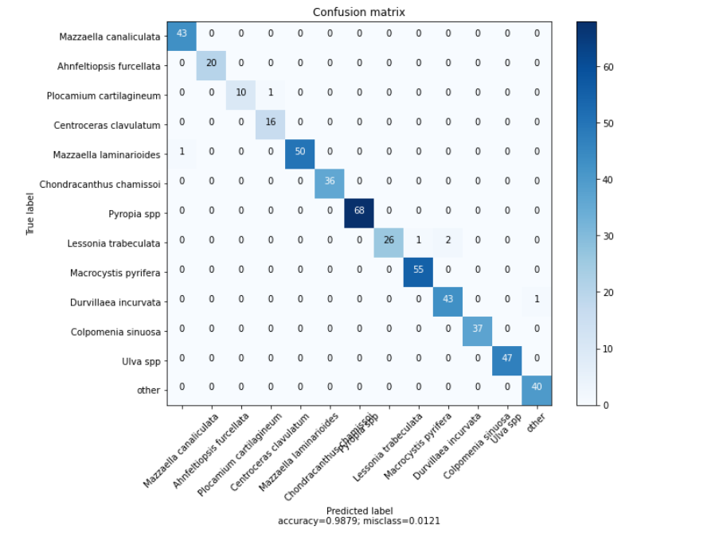
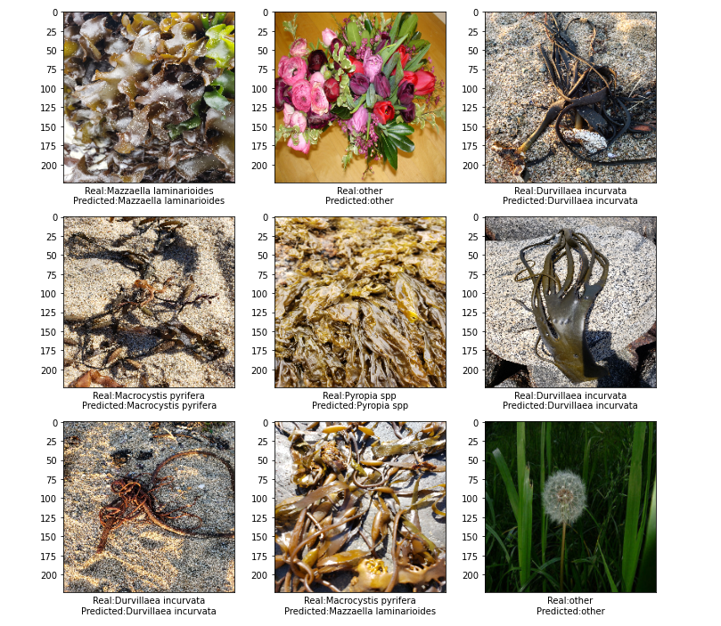

<h2>Algae classifier for the coasts of central Chile, Southamerica</h2>
<p>Prepared by Félix Garcias, f.garcias@uc.cl</p>


## Introductión
This projects includes both back-end (Keras, Flask with dependencies) and the implementation (HTML, CSS, JS) that was finally hosted on Heroku.

This app is designed for those people who they like to walk through the intertidal rocky and the coast in general. Therefore, this model was trained with images of stranded algae on the beach and others algae that we find naturally on rocks. For images taken in laboratory circumstances or other situation, the model could present greater percentage of error to classify.

For this first version, approximately 5.874 images were used, which were separated into a training, test and validation sample (4.992, 882 and 174, respectively).

The images were captured in the following geographic zone:


For this version, transfer learning was used.

Transfer Learning is a machine learning method in which a model with a very complex structure is reused to build a new model.
In this context, I used MobileNetV2 which contains 32 filters in the initial convolutional layer, followed by 19 residual bottleneck layers.


<h3>Construct the Convolutional Neuronal Network (CNN) Architecture and train the model with data</h3>

#### import packages and libraries


```python
import numpy as np
import matplotlib.pyplot as plt
import pandas as pd
import itertools
import os, stat, time
from os.path import dirname as up
import h5py 
import cv2
import pickle
import PIL
from PIL import Image

```


```python
import tensorflow as tf
from tensorflow.python.keras.preprocessing.image import ImageDataGenerator
from tensorflow.python.keras import optimizers
from tensorflow.python.keras.models import Sequential
from tensorflow.python.keras.layers import Dropout, Flatten, Dense, Activation
from tensorflow.python.keras.layers import  Convolution2D, MaxPooling2D
from tensorflow.python.keras import backend as K
from tensorflow import keras
from tensorflow.python.keras.models import Sequential
from tensorflow.python.keras.layers import Activation
from tensorflow.python.keras.layers.core import Dense, Flatten, Dropout
from tensorflow.python.keras.optimizers import Adam
from tensorflow.python.keras.optimizers import RMSprop
from tensorflow.python.keras.metrics import categorical_crossentropy
from tensorflow.python.keras.regularizers import l2
from tensorflow.python.keras.layers.convolutional import *
from tensorflow.python.keras.layers.normalization import BatchNormalization
from tensorflow.python.keras.optimizers import SGD
from tensorflow.keras.models import model_from_json
from tensorflow.python.framework import ops
ops.reset_default_graph()

from keras.preprocessing.image import ImageDataGenerator, array_to_img, img_to_array, load_img
```

### Transforming the images a picke file

The pickle module can store data types such as booleans, strings, and byte arrays, lists, dictionaries, functions, and more. Note: The concept of pickling is also known as serialization, marshaling, and flattening. However, the point is always the same to save an object to a file for later retrieval.


```python

data_dir = "./data/Algas2"


categories = ['Sp1 Nothogenia fastigiata', 'Sp2 Ahnfeltiopsis durvillei', 'Sp3 Centroceras clavulatum', 'Sp4 Mazzaella laminarioides', 'Sp5 Porphyra columbina', 'Sp6 Chondracanthus chamissoi', 'Sp7 Ulva lactuca', 'Sp8 Lessonia Sp', 'Sp9 Macrocystis pyrifera', 'Sp10 Durvillaea antarctica', 'Sp11 Ulva intestinalis','other']


data = []

def make_data():
    for category in categories:
        path = os.path.join(data_dir, category) # ./data/flowers/dasiy

        for img_name in os.listdir(path):
            image_path = os.path.join(path, img_name)
            label = categories.index(category)
            image = cv2.imread(image_path)

            try:
                image = cv2.cvtColor(image, cv2.COLOR_BGR2RGB)
                image = cv2.resize(image, (224,224),3)

                image =np.array(image, dtype=np.float32)

                data.append([image, label])

            except Exception as e:
                pass

    print(len(data))

    pik = open('data.pickle', 'wb')
    pickle.dump(data, pik)
    pik.close()


make_data()	

def load_data():
    pick = open('data.pickle', 'rb')
    data = pickle.load(pick)
    pick.close()

    np.random.shuffle(data)

    feature = []
    labels = []

    for img, label in data:
        feature.append(img)
        labels.append(label)

    feature = np.array(feature, dtype=np.float32)
    labels = np.array(labels)

    feature = feature/255.0

    return [feature, labels]
```

    2294
    

### Train and test sample

Using sklearn.model_selection to separate the images into a training sample and a test sample. The test sample contains 15% of the data.


```python
from sklearn.model_selection import train_test_split

(feature, labels) = load_data()

x_train, x_test, y_train, y_test = train_test_split(feature, labels, test_size=0.15)
```


```python
print("There are {} training examples".format(x_train.shape[0]))
print("There are {} test examples".format(x_test.shape[0]))
print("There are {} training examples".format(y_train.shape[0]))
print("There are {} test examples".format(y_test.shape[0]))
```

    There are 1949 training examples
    There are 345 test examples
    There are 1949 training examples
    There are 345 test examples
    

### Seeing some images of the training sample


```python
plt.figure(figsize=(12,12))
for i in range(9):
    # define subplot
    plt.subplot(330 + 1 + i)
    # plot raw pixel data
    plt.imshow(x_train[i+330])
# show the figure
plt.show()
```


### Building the Convolutional Neural Network (CNN) with Transfer Learning

Sequential and non-sequential convolutional models were tested. however, in this proposal a model with learning transfer is chosen, specifically MobileNetV2


```python

from tensorflow.keras.layers import GlobalAveragePooling2D

input_shape = (224, 224, 3) 
num_classes = 13  

base_model = tf.keras.applications.MobileNetV2(input_shape=input_shape, alpha=1.0, include_top=False)
w = base_model.output
w = GlobalAveragePooling2D()(w)
w = Dense(128, activation="relu")(w)
output = Dense(num_classes, activation="softmax")(w)
model = tf.keras.Model(inputs=[base_model.input], outputs=[output])
```

### Summary of the model architecture


```python
model.summary()
```

    Model: "functional_1"
    __________________________________________________________________________________________________
    Layer (type)                    Output Shape         Param #     Connected to                     
    ==================================================================================================
    input_1 (InputLayer)            [(None, 224, 224, 3) 0                                            
    __________________________________________________________________________________________________
    Conv1_pad (ZeroPadding2D)       (None, 225, 225, 3)  0           input_1[0][0]                    
    __________________________________________________________________________________________________
    Conv1 (Conv2D)                  (None, 112, 112, 32) 864         Conv1_pad[0][0]                  
    __________________________________________________________________________________________________
    bn_Conv1 (BatchNormalization)   (None, 112, 112, 32) 128         Conv1[0][0]                      
    __________________________________________________________________________________________________
    Conv1_relu (ReLU)               (None, 112, 112, 32) 0           bn_Conv1[0][0]                   
    __________________________________________________________________________________________________
    expanded_conv_depthwise (Depthw (None, 112, 112, 32) 288         Conv1_relu[0][0]                 
    __________________________________________________________________________________________________
    expanded_conv_depthwise_BN (Bat (None, 112, 112, 32) 128         expanded_conv_depthwise[0][0]    
    __________________________________________________________________________________________________
    expanded_conv_depthwise_relu (R (None, 112, 112, 32) 0           expanded_conv_depthwise_BN[0][0] 
    __________________________________________________________________________________________________
    expanded_conv_project (Conv2D)  (None, 112, 112, 16) 512         expanded_conv_depthwise_relu[0][0
    __________________________________________________________________________________________________
    expanded_conv_project_BN (Batch (None, 112, 112, 16) 64          expanded_conv_project[0][0]      
    __________________________________________________________________________________________________
    block_1_expand (Conv2D)         (None, 112, 112, 96) 1536        expanded_conv_project_BN[0][0]   
    __________________________________________________________________________________________________
    block_1_expand_BN (BatchNormali (None, 112, 112, 96) 384         block_1_expand[0][0]             
    __________________________________________________________________________________________________
    block_1_expand_relu (ReLU)      (None, 112, 112, 96) 0           block_1_expand_BN[0][0]          
    __________________________________________________________________________________________________
    block_1_pad (ZeroPadding2D)     (None, 113, 113, 96) 0           block_1_expand_relu[0][0]        
    __________________________________________________________________________________________________
    block_1_depthwise (DepthwiseCon (None, 56, 56, 96)   864         block_1_pad[0][0]                
    __________________________________________________________________________________________________
    block_1_depthwise_BN (BatchNorm (None, 56, 56, 96)   384         block_1_depthwise[0][0]          
    __________________________________________________________________________________________________
    block_1_depthwise_relu (ReLU)   (None, 56, 56, 96)   0           block_1_depthwise_BN[0][0]       
    __________________________________________________________________________________________________
    block_1_project (Conv2D)        (None, 56, 56, 24)   2304        block_1_depthwise_relu[0][0]     
    __________________________________________________________________________________________________
    block_1_project_BN (BatchNormal (None, 56, 56, 24)   96          block_1_project[0][0]            
    __________________________________________________________________________________________________
    block_2_expand (Conv2D)         (None, 56, 56, 144)  3456        block_1_project_BN[0][0]         
    __________________________________________________________________________________________________
    block_2_expand_BN (BatchNormali (None, 56, 56, 144)  576         block_2_expand[0][0]             
    __________________________________________________________________________________________________
    block_2_expand_relu (ReLU)      (None, 56, 56, 144)  0           block_2_expand_BN[0][0]          
    __________________________________________________________________________________________________
    block_2_depthwise (DepthwiseCon (None, 56, 56, 144)  1296        block_2_expand_relu[0][0]        
    __________________________________________________________________________________________________
    block_2_depthwise_BN (BatchNorm (None, 56, 56, 144)  576         block_2_depthwise[0][0]          
    __________________________________________________________________________________________________
    block_2_depthwise_relu (ReLU)   (None, 56, 56, 144)  0           block_2_depthwise_BN[0][0]       
    __________________________________________________________________________________________________
    block_2_project (Conv2D)        (None, 56, 56, 24)   3456        block_2_depthwise_relu[0][0]     
    __________________________________________________________________________________________________
    block_2_project_BN (BatchNormal (None, 56, 56, 24)   96          block_2_project[0][0]            
    __________________________________________________________________________________________________
    block_2_add (Add)               (None, 56, 56, 24)   0           block_1_project_BN[0][0]         
                                                                     block_2_project_BN[0][0]         
    __________________________________________________________________________________________________
    block_3_expand (Conv2D)         (None, 56, 56, 144)  3456        block_2_add[0][0]                
    __________________________________________________________________________________________________
    block_3_expand_BN (BatchNormali (None, 56, 56, 144)  576         block_3_expand[0][0]             
    __________________________________________________________________________________________________
    block_3_expand_relu (ReLU)      (None, 56, 56, 144)  0           block_3_expand_BN[0][0]          
    __________________________________________________________________________________________________
    block_3_pad (ZeroPadding2D)     (None, 57, 57, 144)  0           block_3_expand_relu[0][0]        
    __________________________________________________________________________________________________
    block_3_depthwise (DepthwiseCon (None, 28, 28, 144)  1296        block_3_pad[0][0]                
    __________________________________________________________________________________________________
    block_3_depthwise_BN (BatchNorm (None, 28, 28, 144)  576         block_3_depthwise[0][0]          
    __________________________________________________________________________________________________
    block_3_depthwise_relu (ReLU)   (None, 28, 28, 144)  0           block_3_depthwise_BN[0][0]       
    __________________________________________________________________________________________________
    block_3_project (Conv2D)        (None, 28, 28, 32)   4608        block_3_depthwise_relu[0][0]     
    __________________________________________________________________________________________________
    block_3_project_BN (BatchNormal (None, 28, 28, 32)   128         block_3_project[0][0]            
    __________________________________________________________________________________________________
    block_4_expand (Conv2D)         (None, 28, 28, 192)  6144        block_3_project_BN[0][0]         
    __________________________________________________________________________________________________
    block_4_expand_BN (BatchNormali (None, 28, 28, 192)  768         block_4_expand[0][0]             
    __________________________________________________________________________________________________
    block_4_expand_relu (ReLU)      (None, 28, 28, 192)  0           block_4_expand_BN[0][0]          
    __________________________________________________________________________________________________
    block_4_depthwise (DepthwiseCon (None, 28, 28, 192)  1728        block_4_expand_relu[0][0]        
    __________________________________________________________________________________________________
    block_4_depthwise_BN (BatchNorm (None, 28, 28, 192)  768         block_4_depthwise[0][0]          
    __________________________________________________________________________________________________
    block_4_depthwise_relu (ReLU)   (None, 28, 28, 192)  0           block_4_depthwise_BN[0][0]       
    __________________________________________________________________________________________________
    block_4_project (Conv2D)        (None, 28, 28, 32)   6144        block_4_depthwise_relu[0][0]     
    __________________________________________________________________________________________________
    block_4_project_BN (BatchNormal (None, 28, 28, 32)   128         block_4_project[0][0]            
    __________________________________________________________________________________________________
    block_4_add (Add)               (None, 28, 28, 32)   0           block_3_project_BN[0][0]         
                                                                     block_4_project_BN[0][0]         
    __________________________________________________________________________________________________
    block_5_expand (Conv2D)         (None, 28, 28, 192)  6144        block_4_add[0][0]                
    __________________________________________________________________________________________________
    block_5_expand_BN (BatchNormali (None, 28, 28, 192)  768         block_5_expand[0][0]             
    __________________________________________________________________________________________________
    block_5_expand_relu (ReLU)      (None, 28, 28, 192)  0           block_5_expand_BN[0][0]          
    __________________________________________________________________________________________________
    block_5_depthwise (DepthwiseCon (None, 28, 28, 192)  1728        block_5_expand_relu[0][0]        
    __________________________________________________________________________________________________
    block_5_depthwise_BN (BatchNorm (None, 28, 28, 192)  768         block_5_depthwise[0][0]          
    __________________________________________________________________________________________________
    block_5_depthwise_relu (ReLU)   (None, 28, 28, 192)  0           block_5_depthwise_BN[0][0]       
    __________________________________________________________________________________________________
    block_5_project (Conv2D)        (None, 28, 28, 32)   6144        block_5_depthwise_relu[0][0]     
    __________________________________________________________________________________________________
    block_5_project_BN (BatchNormal (None, 28, 28, 32)   128         block_5_project[0][0]            
    __________________________________________________________________________________________________
    block_5_add (Add)               (None, 28, 28, 32)   0           block_4_add[0][0]                
                                                                     block_5_project_BN[0][0]         
    __________________________________________________________________________________________________
    block_6_expand (Conv2D)         (None, 28, 28, 192)  6144        block_5_add[0][0]                
    __________________________________________________________________________________________________
    block_6_expand_BN (BatchNormali (None, 28, 28, 192)  768         block_6_expand[0][0]             
    __________________________________________________________________________________________________
    block_6_expand_relu (ReLU)      (None, 28, 28, 192)  0           block_6_expand_BN[0][0]          
    __________________________________________________________________________________________________
    block_6_pad (ZeroPadding2D)     (None, 29, 29, 192)  0           block_6_expand_relu[0][0]        
    __________________________________________________________________________________________________
    block_6_depthwise (DepthwiseCon (None, 14, 14, 192)  1728        block_6_pad[0][0]                
    __________________________________________________________________________________________________
    block_6_depthwise_BN (BatchNorm (None, 14, 14, 192)  768         block_6_depthwise[0][0]          
    __________________________________________________________________________________________________
    block_6_depthwise_relu (ReLU)   (None, 14, 14, 192)  0           block_6_depthwise_BN[0][0]       
    __________________________________________________________________________________________________
    block_6_project (Conv2D)        (None, 14, 14, 64)   12288       block_6_depthwise_relu[0][0]     
    __________________________________________________________________________________________________
    block_6_project_BN (BatchNormal (None, 14, 14, 64)   256         block_6_project[0][0]            
    __________________________________________________________________________________________________
    block_7_expand (Conv2D)         (None, 14, 14, 384)  24576       block_6_project_BN[0][0]         
    __________________________________________________________________________________________________
    block_7_expand_BN (BatchNormali (None, 14, 14, 384)  1536        block_7_expand[0][0]             
    __________________________________________________________________________________________________
    block_7_expand_relu (ReLU)      (None, 14, 14, 384)  0           block_7_expand_BN[0][0]          
    __________________________________________________________________________________________________
    block_7_depthwise (DepthwiseCon (None, 14, 14, 384)  3456        block_7_expand_relu[0][0]        
    __________________________________________________________________________________________________
    block_7_depthwise_BN (BatchNorm (None, 14, 14, 384)  1536        block_7_depthwise[0][0]          
    __________________________________________________________________________________________________
    block_7_depthwise_relu (ReLU)   (None, 14, 14, 384)  0           block_7_depthwise_BN[0][0]       
    __________________________________________________________________________________________________
    block_7_project (Conv2D)        (None, 14, 14, 64)   24576       block_7_depthwise_relu[0][0]     
    __________________________________________________________________________________________________
    block_7_project_BN (BatchNormal (None, 14, 14, 64)   256         block_7_project[0][0]            
    __________________________________________________________________________________________________
    block_7_add (Add)               (None, 14, 14, 64)   0           block_6_project_BN[0][0]         
                                                                     block_7_project_BN[0][0]         
    __________________________________________________________________________________________________
    block_8_expand (Conv2D)         (None, 14, 14, 384)  24576       block_7_add[0][0]                
    __________________________________________________________________________________________________
    block_8_expand_BN (BatchNormali (None, 14, 14, 384)  1536        block_8_expand[0][0]             
    __________________________________________________________________________________________________
    block_8_expand_relu (ReLU)      (None, 14, 14, 384)  0           block_8_expand_BN[0][0]          
    __________________________________________________________________________________________________
    block_8_depthwise (DepthwiseCon (None, 14, 14, 384)  3456        block_8_expand_relu[0][0]        
    __________________________________________________________________________________________________
    block_8_depthwise_BN (BatchNorm (None, 14, 14, 384)  1536        block_8_depthwise[0][0]          
    __________________________________________________________________________________________________
    block_8_depthwise_relu (ReLU)   (None, 14, 14, 384)  0           block_8_depthwise_BN[0][0]       
    __________________________________________________________________________________________________
    block_8_project (Conv2D)        (None, 14, 14, 64)   24576       block_8_depthwise_relu[0][0]     
    __________________________________________________________________________________________________
    block_8_project_BN (BatchNormal (None, 14, 14, 64)   256         block_8_project[0][0]            
    __________________________________________________________________________________________________
    block_8_add (Add)               (None, 14, 14, 64)   0           block_7_add[0][0]                
                                                                     block_8_project_BN[0][0]         
    __________________________________________________________________________________________________
    block_9_expand (Conv2D)         (None, 14, 14, 384)  24576       block_8_add[0][0]                
    __________________________________________________________________________________________________
    block_9_expand_BN (BatchNormali (None, 14, 14, 384)  1536        block_9_expand[0][0]             
    __________________________________________________________________________________________________
    block_9_expand_relu (ReLU)      (None, 14, 14, 384)  0           block_9_expand_BN[0][0]          
    __________________________________________________________________________________________________
    block_9_depthwise (DepthwiseCon (None, 14, 14, 384)  3456        block_9_expand_relu[0][0]        
    __________________________________________________________________________________________________
    block_9_depthwise_BN (BatchNorm (None, 14, 14, 384)  1536        block_9_depthwise[0][0]          
    __________________________________________________________________________________________________
    block_9_depthwise_relu (ReLU)   (None, 14, 14, 384)  0           block_9_depthwise_BN[0][0]       
    __________________________________________________________________________________________________
    block_9_project (Conv2D)        (None, 14, 14, 64)   24576       block_9_depthwise_relu[0][0]     
    __________________________________________________________________________________________________
    block_9_project_BN (BatchNormal (None, 14, 14, 64)   256         block_9_project[0][0]            
    __________________________________________________________________________________________________
    block_9_add (Add)               (None, 14, 14, 64)   0           block_8_add[0][0]                
                                                                     block_9_project_BN[0][0]         
    __________________________________________________________________________________________________
    block_10_expand (Conv2D)        (None, 14, 14, 384)  24576       block_9_add[0][0]                
    __________________________________________________________________________________________________
    block_10_expand_BN (BatchNormal (None, 14, 14, 384)  1536        block_10_expand[0][0]            
    __________________________________________________________________________________________________
    block_10_expand_relu (ReLU)     (None, 14, 14, 384)  0           block_10_expand_BN[0][0]         
    __________________________________________________________________________________________________
    block_10_depthwise (DepthwiseCo (None, 14, 14, 384)  3456        block_10_expand_relu[0][0]       
    __________________________________________________________________________________________________
    block_10_depthwise_BN (BatchNor (None, 14, 14, 384)  1536        block_10_depthwise[0][0]         
    __________________________________________________________________________________________________
    block_10_depthwise_relu (ReLU)  (None, 14, 14, 384)  0           block_10_depthwise_BN[0][0]      
    __________________________________________________________________________________________________
    block_10_project (Conv2D)       (None, 14, 14, 96)   36864       block_10_depthwise_relu[0][0]    
    __________________________________________________________________________________________________
    block_10_project_BN (BatchNorma (None, 14, 14, 96)   384         block_10_project[0][0]           
    __________________________________________________________________________________________________
    block_11_expand (Conv2D)        (None, 14, 14, 576)  55296       block_10_project_BN[0][0]        
    __________________________________________________________________________________________________
    block_11_expand_BN (BatchNormal (None, 14, 14, 576)  2304        block_11_expand[0][0]            
    __________________________________________________________________________________________________
    block_11_expand_relu (ReLU)     (None, 14, 14, 576)  0           block_11_expand_BN[0][0]         
    __________________________________________________________________________________________________
    block_11_depthwise (DepthwiseCo (None, 14, 14, 576)  5184        block_11_expand_relu[0][0]       
    __________________________________________________________________________________________________
    block_11_depthwise_BN (BatchNor (None, 14, 14, 576)  2304        block_11_depthwise[0][0]         
    __________________________________________________________________________________________________
    block_11_depthwise_relu (ReLU)  (None, 14, 14, 576)  0           block_11_depthwise_BN[0][0]      
    __________________________________________________________________________________________________
    block_11_project (Conv2D)       (None, 14, 14, 96)   55296       block_11_depthwise_relu[0][0]    
    __________________________________________________________________________________________________
    block_11_project_BN (BatchNorma (None, 14, 14, 96)   384         block_11_project[0][0]           
    __________________________________________________________________________________________________
    block_11_add (Add)              (None, 14, 14, 96)   0           block_10_project_BN[0][0]        
                                                                     block_11_project_BN[0][0]        
    __________________________________________________________________________________________________
    block_12_expand (Conv2D)        (None, 14, 14, 576)  55296       block_11_add[0][0]               
    __________________________________________________________________________________________________
    block_12_expand_BN (BatchNormal (None, 14, 14, 576)  2304        block_12_expand[0][0]            
    __________________________________________________________________________________________________
    block_12_expand_relu (ReLU)     (None, 14, 14, 576)  0           block_12_expand_BN[0][0]         
    __________________________________________________________________________________________________
    block_12_depthwise (DepthwiseCo (None, 14, 14, 576)  5184        block_12_expand_relu[0][0]       
    __________________________________________________________________________________________________
    block_12_depthwise_BN (BatchNor (None, 14, 14, 576)  2304        block_12_depthwise[0][0]         
    __________________________________________________________________________________________________
    block_12_depthwise_relu (ReLU)  (None, 14, 14, 576)  0           block_12_depthwise_BN[0][0]      
    __________________________________________________________________________________________________
    block_12_project (Conv2D)       (None, 14, 14, 96)   55296       block_12_depthwise_relu[0][0]    
    __________________________________________________________________________________________________
    block_12_project_BN (BatchNorma (None, 14, 14, 96)   384         block_12_project[0][0]           
    __________________________________________________________________________________________________
    block_12_add (Add)              (None, 14, 14, 96)   0           block_11_add[0][0]               
                                                                     block_12_project_BN[0][0]        
    __________________________________________________________________________________________________
    block_13_expand (Conv2D)        (None, 14, 14, 576)  55296       block_12_add[0][0]               
    __________________________________________________________________________________________________
    block_13_expand_BN (BatchNormal (None, 14, 14, 576)  2304        block_13_expand[0][0]            
    __________________________________________________________________________________________________
    block_13_expand_relu (ReLU)     (None, 14, 14, 576)  0           block_13_expand_BN[0][0]         
    __________________________________________________________________________________________________
    block_13_pad (ZeroPadding2D)    (None, 15, 15, 576)  0           block_13_expand_relu[0][0]       
    __________________________________________________________________________________________________
    block_13_depthwise (DepthwiseCo (None, 7, 7, 576)    5184        block_13_pad[0][0]               
    __________________________________________________________________________________________________
    block_13_depthwise_BN (BatchNor (None, 7, 7, 576)    2304        block_13_depthwise[0][0]         
    __________________________________________________________________________________________________
    block_13_depthwise_relu (ReLU)  (None, 7, 7, 576)    0           block_13_depthwise_BN[0][0]      
    __________________________________________________________________________________________________
    block_13_project (Conv2D)       (None, 7, 7, 160)    92160       block_13_depthwise_relu[0][0]    
    __________________________________________________________________________________________________
    block_13_project_BN (BatchNorma (None, 7, 7, 160)    640         block_13_project[0][0]           
    __________________________________________________________________________________________________
    block_14_expand (Conv2D)        (None, 7, 7, 960)    153600      block_13_project_BN[0][0]        
    __________________________________________________________________________________________________
    block_14_expand_BN (BatchNormal (None, 7, 7, 960)    3840        block_14_expand[0][0]            
    __________________________________________________________________________________________________
    block_14_expand_relu (ReLU)     (None, 7, 7, 960)    0           block_14_expand_BN[0][0]         
    __________________________________________________________________________________________________
    block_14_depthwise (DepthwiseCo (None, 7, 7, 960)    8640        block_14_expand_relu[0][0]       
    __________________________________________________________________________________________________
    block_14_depthwise_BN (BatchNor (None, 7, 7, 960)    3840        block_14_depthwise[0][0]         
    __________________________________________________________________________________________________
    block_14_depthwise_relu (ReLU)  (None, 7, 7, 960)    0           block_14_depthwise_BN[0][0]      
    __________________________________________________________________________________________________
    block_14_project (Conv2D)       (None, 7, 7, 160)    153600      block_14_depthwise_relu[0][0]    
    __________________________________________________________________________________________________
    block_14_project_BN (BatchNorma (None, 7, 7, 160)    640         block_14_project[0][0]           
    __________________________________________________________________________________________________
    block_14_add (Add)              (None, 7, 7, 160)    0           block_13_project_BN[0][0]        
                                                                     block_14_project_BN[0][0]        
    __________________________________________________________________________________________________
    block_15_expand (Conv2D)        (None, 7, 7, 960)    153600      block_14_add[0][0]               
    __________________________________________________________________________________________________
    block_15_expand_BN (BatchNormal (None, 7, 7, 960)    3840        block_15_expand[0][0]            
    __________________________________________________________________________________________________
    block_15_expand_relu (ReLU)     (None, 7, 7, 960)    0           block_15_expand_BN[0][0]         
    __________________________________________________________________________________________________
    block_15_depthwise (DepthwiseCo (None, 7, 7, 960)    8640        block_15_expand_relu[0][0]       
    __________________________________________________________________________________________________
    block_15_depthwise_BN (BatchNor (None, 7, 7, 960)    3840        block_15_depthwise[0][0]         
    __________________________________________________________________________________________________
    block_15_depthwise_relu (ReLU)  (None, 7, 7, 960)    0           block_15_depthwise_BN[0][0]      
    __________________________________________________________________________________________________
    block_15_project (Conv2D)       (None, 7, 7, 160)    153600      block_15_depthwise_relu[0][0]    
    __________________________________________________________________________________________________
    block_15_project_BN (BatchNorma (None, 7, 7, 160)    640         block_15_project[0][0]           
    __________________________________________________________________________________________________
    block_15_add (Add)              (None, 7, 7, 160)    0           block_14_add[0][0]               
                                                                     block_15_project_BN[0][0]        
    __________________________________________________________________________________________________
    block_16_expand (Conv2D)        (None, 7, 7, 960)    153600      block_15_add[0][0]               
    __________________________________________________________________________________________________
    block_16_expand_BN (BatchNormal (None, 7, 7, 960)    3840        block_16_expand[0][0]            
    __________________________________________________________________________________________________
    block_16_expand_relu (ReLU)     (None, 7, 7, 960)    0           block_16_expand_BN[0][0]         
    __________________________________________________________________________________________________
    block_16_depthwise (DepthwiseCo (None, 7, 7, 960)    8640        block_16_expand_relu[0][0]       
    __________________________________________________________________________________________________
    block_16_depthwise_BN (BatchNor (None, 7, 7, 960)    3840        block_16_depthwise[0][0]         
    __________________________________________________________________________________________________
    block_16_depthwise_relu (ReLU)  (None, 7, 7, 960)    0           block_16_depthwise_BN[0][0]      
    __________________________________________________________________________________________________
    block_16_project (Conv2D)       (None, 7, 7, 320)    307200      block_16_depthwise_relu[0][0]    
    __________________________________________________________________________________________________
    block_16_project_BN (BatchNorma (None, 7, 7, 320)    1280        block_16_project[0][0]           
    __________________________________________________________________________________________________
    Conv_1 (Conv2D)                 (None, 7, 7, 1280)   409600      block_16_project_BN[0][0]        
    __________________________________________________________________________________________________
    Conv_1_bn (BatchNormalization)  (None, 7, 7, 1280)   5120        Conv_1[0][0]                     
    __________________________________________________________________________________________________
    out_relu (ReLU)                 (None, 7, 7, 1280)   0           Conv_1_bn[0][0]                  
    __________________________________________________________________________________________________
    global_average_pooling2d (Globa (None, 1280)         0           out_relu[0][0]                   
    __________________________________________________________________________________________________
    dense (Dense)                   (None, 128)          163968      global_average_pooling2d[0][0]   
    __________________________________________________________________________________________________
    dense_1 (Dense)                 (None, 13)           1677        dense[0][0]        
    ==================================================================================================
    Total params: 2,423,629
    Trainable params: 2,389,517
    Non-trainable params: 34,112
    __________________________________________________________________________________________________
    

### Compiling the model


```python
model.compile(optimizer=tf.keras.optimizers.Adadelta(), loss='sparse_categorical_crossentropy',
    metrics=['accuracy'])
```

### Model fit in 80 epoch


```python
history = model.fit(x_train,y_train,steps_per_epoch=None,epochs=80,validation_data=(x_test,y_test))

```

    Epoch 1/80
    WARNING:tensorflow:AutoGraph could not transform <function Model.make_train_function.<locals>.train_function at 0x0000021A1D85D8B8> and will run it as-is.
    Please report this to the TensorFlow team. When filing the bug, set the verbosity to 10 (on Linux, `export AUTOGRAPH_VERBOSITY=10`) and attach the full output.
    Cause: 'arguments' object has no attribute 'posonlyargs'
    To silence this warning, decorate the function with @tf.autograph.experimental.do_not_convert
    WARNING: AutoGraph could not transform <function Model.make_train_function.<locals>.train_function at 0x0000021A1D85D8B8> and will run it as-is.
    Please report this to the TensorFlow team. When filing the bug, set the verbosity to 10 (on Linux, `export AUTOGRAPH_VERBOSITY=10`) and attach the full output.
    Cause: 'arguments' object has no attribute 'posonlyargs'
    To silence this warning, decorate the function with @tf.autograph.experimental.do_not_convert
    104/104 [==============================] - ETA: 0s - loss: 2.6588 - accuracy: 0.0957WARNING:tensorflow:AutoGraph could not transform <function Model.make_test_function.<locals>.test_function at 0x0000021A1D6FF0D8> and will run it as-is.
    Please report this to the TensorFlow team. When filing the bug, set the verbosity to 10 (on Linux, `export AUTOGRAPH_VERBOSITY=10`) and attach the full output.
    Cause: 'arguments' object has no attribute 'posonlyargs'
    To silence this warning, decorate the function with @tf.autograph.experimental.do_not_convert
    WARNING: AutoGraph could not transform <function Model.make_test_function.<locals>.test_function at 0x0000021A1D6FF0D8> and will run it as-is.
    Please report this to the TensorFlow team. When filing the bug, set the verbosity to 10 (on Linux, `export AUTOGRAPH_VERBOSITY=10`) and attach the full output.
    Cause: 'arguments' object has no attribute 'posonlyargs'
    To silence this warning, decorate the function with @tf.autograph.experimental.do_not_convert
    104/104 [==============================] - 470s 5s/step - loss: 2.6588 - accuracy: 0.0957 - val_loss: 2.5985 - val_accuracy: 0.1265
    Epoch 2/80
    104/104 [==============================] - 514s 5s/step - loss: 2.4957 - accuracy: 0.1519 - val_loss: 2.5019 - val_accuracy: 0.1504
    Epoch 3/80
    104/104 [==============================] - 494s 5s/step - loss: 2.3420 - accuracy: 0.2005 - val_loss: 2.4040 - val_accuracy: 0.1829
    Epoch 4/80
    104/104 [==============================] - 490s 5s/step - loss: 2.2081 - accuracy: 0.2591 - val_loss: 2.2993 - val_accuracy: 0.2239
    Epoch 5/80
    104/104 [==============================] - 486s 5s/step - loss: 2.1012 - accuracy: 0.3235 - val_loss: 2.1947 - val_accuracy: 0.2667
    Epoch 6/80
    104/104 [==============================] - 491s 5s/step - loss: 1.9864 - accuracy: 0.3751 - val_loss: 2.0892 - val_accuracy: 0.3299
    Epoch 7/80
    104/104 [==============================] - 490s 5s/step - loss: 1.8795 - accuracy: 0.4388 - val_loss: 1.9805 - val_accuracy: 0.3829
    Epoch 8/80
    104/104 [==============================] - 486s 5s/step - loss: 1.7794 - accuracy: 0.4965 - val_loss: 1.8761 - val_accuracy: 0.4513
    Epoch 9/80
    104/104 [==============================] - 491s 5s/step - loss: 1.6806 - accuracy: 0.5397 - val_loss: 1.7738 - val_accuracy: 0.4940
    Epoch 10/80
    104/104 [==============================] - 488s 5s/step - loss: 1.5899 - accuracy: 0.5929 - val_loss: 1.6780 - val_accuracy: 0.5333
    Epoch 11/80
    104/104 [==============================] - 489s 5s/step - loss: 1.4968 - accuracy: 0.6264 - val_loss: 1.5862 - val_accuracy: 0.5641
    Epoch 12/80
    104/104 [==============================] - 496s 5s/step - loss: 1.4102 - accuracy: 0.6696 - val_loss: 1.5004 - val_accuracy: 0.6017
    Epoch 13/80
    104/104 [==============================] - 488s 5s/step - loss: 1.3371 - accuracy: 0.6862 - val_loss: 1.4211 - val_accuracy: 0.6291
    Epoch 14/80
    104/104 [==============================] - 488s 5s/step - loss: 1.2559 - accuracy: 0.7197 - val_loss: 1.3459 - val_accuracy: 0.6513
    Epoch 15/80
    104/104 [==============================] - 489s 5s/step - loss: 1.1946 - accuracy: 0.7451 - val_loss: 1.2773 - val_accuracy: 0.6752
    Epoch 16/80
    104/104 [==============================] - 490s 5s/step - loss: 1.1312 - accuracy: 0.7535 - val_loss: 1.2130 - val_accuracy: 0.6889
    Epoch 17/80
    104/104 [==============================] - 488s 5s/step - loss: 1.0863 - accuracy: 0.7647 - val_loss: 1.1533 - val_accuracy: 0.7077
    Epoch 18/80
    104/104 [==============================] - 489s 5s/step - loss: 1.0149 - accuracy: 0.7819 - val_loss: 1.0985 - val_accuracy: 0.7385
    Epoch 19/80
    104/104 [==============================] - 491s 5s/step - loss: 0.9718 - accuracy: 0.7880 - val_loss: 1.0477 - val_accuracy: 0.7538
    Epoch 20/80
    104/104 [==============================] - 491s 5s/step - loss: 0.9363 - accuracy: 0.7949 - val_loss: 1.0011 - val_accuracy: 0.7624
    Epoch 21/80
    104/104 [==============================] - 487s 5s/step - loss: 0.8856 - accuracy: 0.8028 - val_loss: 0.9584 - val_accuracy: 0.7812
    Epoch 22/80
    104/104 [==============================] - 488s 5s/step - loss: 0.8466 - accuracy: 0.8164 - val_loss: 0.9195 - val_accuracy: 0.7915
    Epoch 23/80
    104/104 [==============================] - 491s 5s/step - loss: 0.8095 - accuracy: 0.8206 - val_loss: 0.8823 - val_accuracy: 0.8017
    Epoch 24/80
    104/104 [==============================] - 491s 5s/step - loss: 0.7644 - accuracy: 0.8330 - val_loss: 0.8489 - val_accuracy: 0.8085
    Epoch 25/80
    104/104 [==============================] - 489s 5s/step - loss: 0.7316 - accuracy: 0.8445 - val_loss: 0.8174 - val_accuracy: 0.8154
    Epoch 26/80
    104/104 [==============================] - 488s 5s/step - loss: 0.7077 - accuracy: 0.8375 - val_loss: 0.7867 - val_accuracy: 0.8239
    Epoch 27/80
    104/104 [==============================] - 489s 5s/step - loss: 0.6747 - accuracy: 0.8484 - val_loss: 0.7582 - val_accuracy: 0.8239
    Epoch 28/80
    104/104 [==============================] - 490s 5s/step - loss: 0.6545 - accuracy: 0.8514 - val_loss: 0.7310 - val_accuracy: 0.8325
    Epoch 29/80
    104/104 [==============================] - 490s 5s/step - loss: 0.6225 - accuracy: 0.8574 - val_loss: 0.7061 - val_accuracy: 0.8376
    Epoch 30/80
    104/104 [==============================] - 491s 5s/step - loss: 0.6081 - accuracy: 0.8620 - val_loss: 0.6826 - val_accuracy: 0.8410
    Epoch 31/80
    104/104 [==============================] - 492s 5s/step - loss: 0.5887 - accuracy: 0.8599 - val_loss: 0.6606 - val_accuracy: 0.8496
    Epoch 32/80
    104/104 [==============================] - 489s 5s/step - loss: 0.5578 - accuracy: 0.8771 - val_loss: 0.6403 - val_accuracy: 0.8530
    Epoch 33/80
    104/104 [==============================] - 488s 5s/step - loss: 0.5479 - accuracy: 0.8707 - val_loss: 0.6209 - val_accuracy: 0.8564
    Epoch 34/80
    104/104 [==============================] - 487s 5s/step - loss: 0.5376 - accuracy: 0.8789 - val_loss: 0.6023 - val_accuracy: 0.8581
    Epoch 35/80
    104/104 [==============================] - 486s 5s/step - loss: 0.5051 - accuracy: 0.8825 - val_loss: 0.5849 - val_accuracy: 0.8598
    Epoch 36/80
    104/104 [==============================] - 491s 5s/step - loss: 0.4924 - accuracy: 0.8816 - val_loss: 0.5676 - val_accuracy: 0.8632
    Epoch 37/80
    104/104 [==============================] - 491s 5s/step - loss: 0.4725 - accuracy: 0.8861 - val_loss: 0.5514 - val_accuracy: 0.8650
    Epoch 38/80
    104/104 [==============================] - 491s 5s/step - loss: 0.4615 - accuracy: 0.8886 - val_loss: 0.5355 - val_accuracy: 0.8650
    Epoch 39/80
    104/104 [==============================] - 490s 5s/step - loss: 0.4443 - accuracy: 0.8934 - val_loss: 0.5212 - val_accuracy: 0.8701
    Epoch 40/80
    104/104 [==============================] - 490s 5s/step - loss: 0.4382 - accuracy: 0.8991 - val_loss: 0.5076 - val_accuracy: 0.8701
    Epoch 41/80
    104/104 [==============================] - 490s 5s/step - loss: 0.4233 - accuracy: 0.9067 - val_loss: 0.4948 - val_accuracy: 0.8701
    Epoch 42/80
    104/104 [==============================] - 488s 5s/step - loss: 0.4139 - accuracy: 0.9040 - val_loss: 0.4822 - val_accuracy: 0.8752
    Epoch 43/80
    104/104 [==============================] - 488s 5s/step - loss: 0.4038 - accuracy: 0.9040 - val_loss: 0.4701 - val_accuracy: 0.8769
    Epoch 44/80
    104/104 [==============================] - 490s 5s/step - loss: 0.3791 - accuracy: 0.9094 - val_loss: 0.4584 - val_accuracy: 0.8786
    Epoch 45/80
    104/104 [==============================] - 488s 5s/step - loss: 0.3798 - accuracy: 0.9082 - val_loss: 0.4471 - val_accuracy: 0.8803
    Epoch 46/80
    104/104 [==============================] - 491s 5s/step - loss: 0.3657 - accuracy: 0.9136 - val_loss: 0.4371 - val_accuracy: 0.8838
    Epoch 47/80
    104/104 [==============================] - 491s 5s/step - loss: 0.3554 - accuracy: 0.9175 - val_loss: 0.4270 - val_accuracy: 0.8838
    Epoch 48/80
    104/104 [==============================] - 495s 5s/step - loss: 0.3550 - accuracy: 0.9154 - val_loss: 0.4173 - val_accuracy: 0.8855
    Epoch 49/80
    104/104 [==============================] - 487s 5s/step - loss: 0.3426 - accuracy: 0.9182 - val_loss: 0.4082 - val_accuracy: 0.8906
    Epoch 50/80
    104/104 [==============================] - 488s 5s/step - loss: 0.3205 - accuracy: 0.9284 - val_loss: 0.3991 - val_accuracy: 0.8940
    Epoch 51/80
    104/104 [==============================] - 490s 5s/step - loss: 0.3328 - accuracy: 0.9221 - val_loss: 0.3906 - val_accuracy: 0.8957
    Epoch 52/80
    104/104 [==============================] - 491s 5s/step - loss: 0.3023 - accuracy: 0.9342 - val_loss: 0.3822 - val_accuracy: 0.8974
    Epoch 53/80
    104/104 [==============================] - 491s 5s/step - loss: 0.3073 - accuracy: 0.9245 - val_loss: 0.3748 - val_accuracy: 0.8974
    Epoch 54/80
    104/104 [==============================] - 489s 5s/step - loss: 0.2965 - accuracy: 0.9305 - val_loss: 0.3674 - val_accuracy: 0.9009
    Epoch 55/80
    104/104 [==============================] - 489s 5s/step - loss: 0.2877 - accuracy: 0.9369 - val_loss: 0.3598 - val_accuracy: 0.9009
    Epoch 56/80
    104/104 [==============================] - 488s 5s/step - loss: 0.2904 - accuracy: 0.9323 - val_loss: 0.3527 - val_accuracy: 0.9009
    Epoch 57/80
    104/104 [==============================] - 491s 5s/step - loss: 0.2811 - accuracy: 0.9357 - val_loss: 0.3461 - val_accuracy: 0.9026
    Epoch 58/80
    104/104 [==============================] - 490s 5s/step - loss: 0.2693 - accuracy: 0.9423 - val_loss: 0.3402 - val_accuracy: 0.9043
    Epoch 59/80
    104/104 [==============================] - 489s 5s/step - loss: 0.2620 - accuracy: 0.9435 - val_loss: 0.3337 - val_accuracy: 0.9060
    Epoch 60/80
    104/104 [==============================] - 510s 5s/step - loss: 0.2523 - accuracy: 0.9432 - val_loss: 0.3276 - val_accuracy: 0.9077
    Epoch 61/80
    104/104 [==============================] - 489s 5s/step - loss: 0.2414 - accuracy: 0.9468 - val_loss: 0.3223 - val_accuracy: 0.9077
    Epoch 62/80
    104/104 [==============================] - 489s 5s/step - loss: 0.2490 - accuracy: 0.9471 - val_loss: 0.3167 - val_accuracy: 0.9077
    Epoch 63/80
    104/104 [==============================] - 488s 5s/step - loss: 0.2452 - accuracy: 0.9453 - val_loss: 0.3116 - val_accuracy: 0.9128
    Epoch 64/80
    104/104 [==============================] - 488s 5s/step - loss: 0.2378 - accuracy: 0.9477 - val_loss: 0.3064 - val_accuracy: 0.9128
    Epoch 65/80
    104/104 [==============================] - 492s 5s/step - loss: 0.2279 - accuracy: 0.9477 - val_loss: 0.3018 - val_accuracy: 0.9128
    Epoch 66/80
    104/104 [==============================] - 489s 5s/step - loss: 0.2279 - accuracy: 0.9474 - val_loss: 0.2972 - val_accuracy: 0.9145
    Epoch 67/80
    104/104 [==============================] - 488s 5s/step - loss: 0.2190 - accuracy: 0.9508 - val_loss: 0.2929 - val_accuracy: 0.9162
    Epoch 68/80
    104/104 [==============================] - 491s 5s/step - loss: 0.2167 - accuracy: 0.9520 - val_loss: 0.2884 - val_accuracy: 0.9162
    Epoch 69/80
    104/104 [==============================] - 490s 5s/step - loss: 0.2116 - accuracy: 0.9535 - val_loss: 0.2842 - val_accuracy: 0.9162
    Epoch 70/80
    104/104 [==============================] - 490s 5s/step - loss: 0.2084 - accuracy: 0.9568 - val_loss: 0.2803 - val_accuracy: 0.9179
    Epoch 71/80
    104/104 [==============================] - 486s 5s/step - loss: 0.2085 - accuracy: 0.9535 - val_loss: 0.2766 - val_accuracy: 0.9214
    Epoch 72/80
    104/104 [==============================] - 492s 5s/step - loss: 0.1952 - accuracy: 0.9547 - val_loss: 0.2727 - val_accuracy: 0.9231
    Epoch 73/80
    104/104 [==============================] - 490s 5s/step - loss: 0.1983 - accuracy: 0.9562 - val_loss: 0.2692 - val_accuracy: 0.9231
    Epoch 74/80
    104/104 [==============================] - 485s 5s/step - loss: 0.1950 - accuracy: 0.9571 - val_loss: 0.2658 - val_accuracy: 0.9265
    Epoch 75/80
    104/104 [==============================] - 487s 5s/step - loss: 0.1923 - accuracy: 0.9586 - val_loss: 0.2620 - val_accuracy: 0.9265
    Epoch 76/80
    104/104 [==============================] - 485s 5s/step - loss: 0.1843 - accuracy: 0.9607 - val_loss: 0.2584 - val_accuracy: 0.9299
    Epoch 77/80
    104/104 [==============================] - 486s 5s/step - loss: 0.1789 - accuracy: 0.9610 - val_loss: 0.2552 - val_accuracy: 0.9299
    Epoch 78/80
    104/104 [==============================] - 489s 5s/step - loss: 0.1777 - accuracy: 0.9607 - val_loss: 0.2521 - val_accuracy: 0.9299
    Epoch 79/80
    104/104 [==============================] - 487s 5s/step - loss: 0.1733 - accuracy: 0.9662 - val_loss: 0.2492 - val_accuracy: 0.9333
    Epoch 80/80
    104/104 [==============================] - 492s 5s/step - loss: 0.1764 - accuracy: 0.9610 - val_loss: 0.2461 - val_accuracy: 0.9333
    

### Defining a function to graph the fit of the model (accuracy) and its loss in each epoch


```python
def plot_model_history(model_name, history, epochs):
  
  print(model_name)
  plt.figure(figsize=(15, 5))
  
  # summarize history for accuracy
  plt.subplot(1, 2 ,1)
  plt.plot(np.arange(0, len(model.history.history['accuracy'])), model.history.history['accuracy'], 'r')
  plt.plot(np.arange(1, len(model.history.history['val_accuracy'])+1), model.history.history['val_accuracy'], 'g')
  plt.xticks(np.arange(0, epochs+1, epochs/10))
  plt.title('Training Accuracy vs. Validation Accuracy')
  plt.xlabel('Num of Epochs')
  plt.ylabel('Accuracy')
  plt.legend(['train', 'validation'], loc='best')
  
  plt.subplot(1, 2, 2)
  plt.plot(np.arange(1, len(model.history.history['loss'])+1), model.history.history['loss'], 'r')
  plt.plot(np.arange(1, len(model.history.history['val_loss'])+1), model.history.history['val_loss'], 'g')
  plt.xticks(np.arange(0, epochs+1, epochs/10))
  plt.title('Training Loss vs. Validation Loss')
  plt.xlabel('Num of Epochs')
  plt.ylabel('Loss')
  plt.legend(['train', 'validation'], loc='best')
  
  
  plt.show()
```

### Accuracy and Lost
When making the graph, a good fit of the model is observed, which reached an accuracy of 96% in the training sample and 87% in the test sample.


```python
plot_model_history('model_scratch', history.history, 60)
```

    model_scratch
    


### Generating the confusion matrix


```python
x_traincm,x_val,y_traincm,y_val = train_test_split(x_train,y_train,test_size = 0.15)
```


```python
import seaborn as sb
from sklearn.metrics import confusion_matrix
Y_pred = model.predict(x_val)
Y_pred_classes = np.argmax(Y_pred,axis = 1)
Y_true = y_val
confusion_mtx = confusion_matrix(Y_true,Y_pred_classes)
f,ax = plt.subplots(figsize = (8,8))
sb.heatmap(confusion_mtx,annot=True,linewidths = 0.01,cmap="Greens",
            linecolor = "gray",fmt = ".2f",ax=ax
            )
plt.xlabel("predicted label")
plt.ylabel("True Label")
plt.title("confusion matrix")
plt.show()
```

    WARNING:tensorflow:AutoGraph could not transform <function Model.make_predict_function.<locals>.predict_function at 0x0000024707603A68> and will run it as-is.
    Please report this to the TensorFlow team. When filing the bug, set the verbosity to 10 (on Linux, `export AUTOGRAPH_VERBOSITY=10`) and attach the full output.
    Cause: 'arguments' object has no attribute 'posonlyargs'
    To silence this warning, decorate the function with @tf.autograph.experimental.do_not_convert
    WARNING: AutoGraph could not transform <function Model.make_predict_function.<locals>.predict_function at 0x0000024707603A68> and will run it as-is.
    Please report this to the TensorFlow team. When filing the bug, set the verbosity to 10 (on Linux, `export AUTOGRAPH_VERBOSITY=10`) and attach the full output.
    Cause: 'arguments' object has no attribute 'posonlyargs'
    To silence this warning, decorate the function with @tf.autograph.experimental.do_not_convert
    


### Formatting the confusion matrix


```python
def plot_confusion_matrix(cm,
                          target_names,
                          title='Confusion matrix',
                          cmap=None,
                          normalize=True):

    import itertools

    accuracy = np.trace(cm) / float(np.sum(cm))
    misclass = 1 - accuracy

    if cmap is None:
        cmap = plt.get_cmap('Blues')

    plt.figure(figsize=(10, 8))
    plt.imshow(cm, interpolation='nearest', cmap=cmap)
    plt.title(title)
    plt.colorbar()

    if target_names is not None:
        tick_marks = np.arange(len(target_names))
        plt.xticks(tick_marks, target_names, rotation=45)
        plt.yticks(tick_marks, target_names)

    if normalize:
        cm = cm.astype('float') / cm.sum(axis=1)[:, np.newaxis]
        cm = np.around(cm, decimals=2)
       # cm[np.isnan(cm)] = 0.0

    thresh = cm.max() / 1.5 if normalize else cm.max() / 2
    for i, j in itertools.product(range(cm.shape[0]), range(cm.shape[1])):
        if normalize:
            plt.text(j, i, "{:0.4f}".format(cm[i, j]),
                     horizontalalignment="center",
                     color="white" if cm[i, j] > thresh else "black")
        else:
            plt.text(j, i, "{:,}".format(cm[i, j]),
                     horizontalalignment="center",
                     color="white" if cm[i, j] > thresh else "black")


    plt.tight_layout()
    plt.ylabel('True label')
    plt.xlabel('Predicted label\naccuracy={:0.4f}; misclass={:0.4f}'.format(accuracy, misclass))
    plt.show()
```

### Confusion matrix

Although the confusion matrix shows a 96% fit, the training sample in each epoch showed a maximum of 93%. In this context, the model still confuses 𝑁Plo𝑜𝑡ℎ𝑜𝑔𝑒𝑛𝑖𝑎 𝑓𝑎𝑠𝑡𝑖𝑔𝑖𝑎𝑡𝑎 with 𝐶ℎ𝑜𝑛𝑑𝑟𝑎𝑐𝑎𝑛𝑡ℎ𝑢𝑠 𝑐ℎ𝑎𝑚𝑖𝑠𝑠𝑜𝑖 and to a lesser degree with 𝐴ℎ𝑛𝑓𝑒𝑙𝑡𝑖𝑜𝑝𝑠𝑖𝑠 𝑑𝑢𝑟𝑣𝑖𝑙𝑙𝑒𝑖 and 𝐶𝑒𝑛𝑡𝑟𝑜𝑐𝑒𝑟𝑎𝑠 𝑐𝑙𝑎𝑣𝑢𝑙𝑎𝑡𝑢𝑚. On the other hand, when the model is test with a validation sample (images that were not considered at any stage of the modeling) the brown macro algae also showed a relatively high degree of confusion because this group corresponds to the classes with fewer numbers of pictures.


```python
#categories = ['Nothogenia fastigiata', 'Ahnfeltiopsis durvillei', 'Centroceras clavulatum', 'Mazzaella laminarioides', 'Porphyra columbina', 'Chondracanthus chamissoi', 'Ulva lactuca', 'Lessonia Sp', 'Macrocystis pyrifera', 'Durvillaea antarctica','Ulva intestinalis','other']
categories = ['Nothogenia sp', 'Ahnfeltiopsis sp', 'Centroceras sp', 'Mazzaella sp', 'Porphyra sp', 'Chondracanthus sp', 'Ulva lactuca', 'Lessonia Sp', 'Macrocystis sp', 'Durvillaea sp','Ulva intestinalis','other']

plot_confusion_matrix(confusion_mtx,categories, cmap=None, normalize=False)
```





### Saving the weights and the model to implement in flask


```python
# Save the Model Weights
model.save_weights('model_80_eopchs_adam_20210624_01.h5')
```


```python
# Save the Model to JSON
model_json = model.to_json()
with open('model_adam_20210624_01.json', 'w') as json_file:
    json_file.write(model_json)
    
print('Model saved to the disk.')
```

    Model saved to the disk.
    


```python
# Get the architecture of CNN
json_file = open('model_adam_20210624_01.json')
loaded_model_json = json_file.read()
json_file.close()
loaded_model = model_from_json(loaded_model_json)
```


```python
# Get weights into the model
loaded_model.load_weights('model_80_eopchs_adam_20210624_01.h5')
```


```python
# Define optimizer and run
opt = keras.optimizers.Adam(lr=0.00001, beta_1=0.9, beta_2=0.999, epsilon=None, decay=0.0)
loaded_model.compile(loss='sparse_categorical_crossentropy', metrics=['accuracy'], optimizer=opt)
```

### Testing the model with the validation sample


```python
# test imagen
IMG = Image.open('./data/validacion/especie1/20210202_115012.jpg')
print(type(IMG))
IMG = IMG.resize((224, 224))
IMG = np.array(IMG)
print('po array = {}'.format(IMG.shape))
IMG = np.true_divide(IMG, 255)
IMG = IMG.reshape(-1, 224, 224, 3)
print(type(IMG), IMG.shape)

predictions = loaded_model.predict(IMG)

print(loaded_model)
predictions_c = np.argmax(predictions, axis=1)
print(predictions, predictions_c)
```

    <class 'PIL.JpegImagePlugin.JpegImageFile'>
    po array = (224, 224, 3)
    <class 'numpy.ndarray'> (1, 224, 224, 3)
    WARNING:tensorflow:AutoGraph could not transform <function Model.make_predict_function.<locals>.predict_function at 0x0000024704E3B708> and will run it as-is.
    Please report this to the TensorFlow team. When filing the bug, set the verbosity to 10 (on Linux, `export AUTOGRAPH_VERBOSITY=10`) and attach the full output.
    Cause: 'arguments' object has no attribute 'posonlyargs'
    To silence this warning, decorate the function with @tf.autograph.experimental.do_not_convert
    WARNING: AutoGraph could not transform <function Model.make_predict_function.<locals>.predict_function at 0x0000024704E3B708> and will run it as-is.
    Please report this to the TensorFlow team. When filing the bug, set the verbosity to 10 (on Linux, `export AUTOGRAPH_VERBOSITY=10`) and attach the full output.
    Cause: 'arguments' object has no attribute 'posonlyargs'
    To silence this warning, decorate the function with @tf.autograph.experimental.do_not_convert
    <tensorflow.python.keras.engine.functional.Functional object at 0x00000247042EB788>
    [[9.6397865e-01 7.0861995e-04 6.6555766e-03 1.9888134e-07 3.3728794e-11
      8.6002250e-04 1.1000242e-09 2.4622347e-04 9.5898031e-07 5.8490027e-06
      2.0430596e-08 2.7543891e-02]] [0]
    

### Images of the test sample with real label and predicted

Note that the model still confuses 𝑁𝑜𝑡ℎ𝑜𝑔𝑒𝑛𝑖𝑎 𝑓𝑎𝑠𝑡𝑖𝑔𝑖𝑎𝑡𝑎 with 𝐶ℎ𝑜𝑛𝑑𝑟𝑎𝑐𝑎𝑛𝑡ℎ𝑢𝑠 𝑐ℎ𝑎𝑚𝑖𝑠𝑠𝑜𝑖.


```python
plt.figure(figsize=(12,12))

for i in range(9):
    plt.subplot(330 + 1 + i)
    plt.imshow(x_test[i])
    plt.xlabel('Real:'+ categories[y_test[i]]+'\n'+'Predicted:'+
              categories[np.argmax(prediction2[i])])
    
    plt.xticks([])
    
plt.show()
```





More images of the test sample with real label and predicted


```python

plt.figure(figsize=(12,12))

for i in range(9):
    plt.subplot(330 + 1 + i)
    plt.imshow(x_test[i+18])
    plt.xlabel('Real:'+ categories[y_test[i+18]]+'\n'+'Predicted:'+
              categories[np.argmax(prediction2[i+18])])
    
    plt.xticks([])
    
plt.show()
```


### Next steps

It is necessary to increase the images not only in number, but also in species quantity,  geographical places and times of the day. Since the precision results obtained are exclusive for particular conditions.

If you want to cooperate with this development you can contact me at:

Félix Garcias H.
f.garciash@uc.cl
